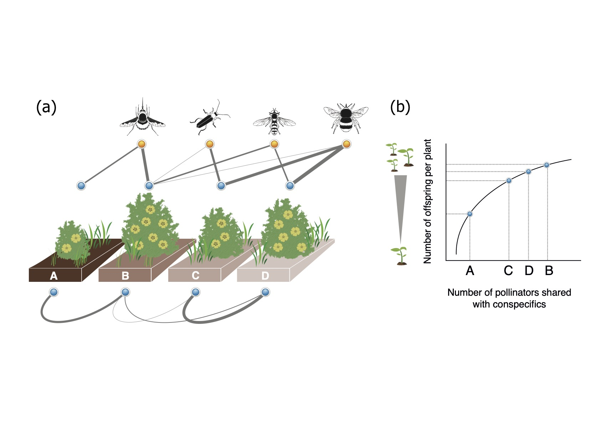

# Individual-based plant-pollinator networks are structured by phenotypic and microsite plant traits

## Abstract

1. The biotic and abiotic context of individual plants within animal-pollinated plant populations can influence pollinator foraging behavior. Pollinator movements regulate pollen flow among plant individuals, and ultimately determine individual plant reproductive success. Yet the underlying drivers of this context-dependency of interactions at the population level and their functional consequences for individuals remain poorly known.
2. Here we used a well-characterised population of Halimium halimifolium (Cistaceae), a Mediterranean shrub species, in combination with exponential random graph models (ERGMs) to evaluate how the intrapopulation variation in plant attributes configures individual-based plant-pollinator networks and determines their reproductive outcomes. Specifically, we assessed (i) how the intrinsic (i.e., phenotype and phenology) and extrinsic (i.e., microsite) plant attributes influenced the emerging configuration of the bipartite plant-pollinator network and the unipartite plant-plant network derived from pollinator sharing, and (ii) how these plant attributes combined with the network topological position of individual plants affect their female fitness, measured as the total seed weight per plant.
3. We found that both intrinsic and extrinsic plant attributes contributed substantially to explain the configuration of both the bipartite and the unipartite pollination network. Besides the effects of plant attributes, the functional group to which pollinator species belonged was also important to determine the variance in plant-pollinator interaction odds, while the probability of plants to share more pollinator species was additionally influenced by the spatial distance between those plants. Further, our results showed that these influences of plant attributes on network structure can be translated into functional outcomes at the plant individual level, with direct consequences for intrapopulation fitness variation. 
4. Synthesis. This study builds towards a better understanding of the multiple drivers underlying the context-dependency of plant-pollinator interactions and how they mediate the reproductive outputs for individual plants within a population. The application of our analytical framework allows a conceptual shift from descriptive to predictive research on the evolutionary and ecological processes that give rise to complex ecological networks within populations. 

